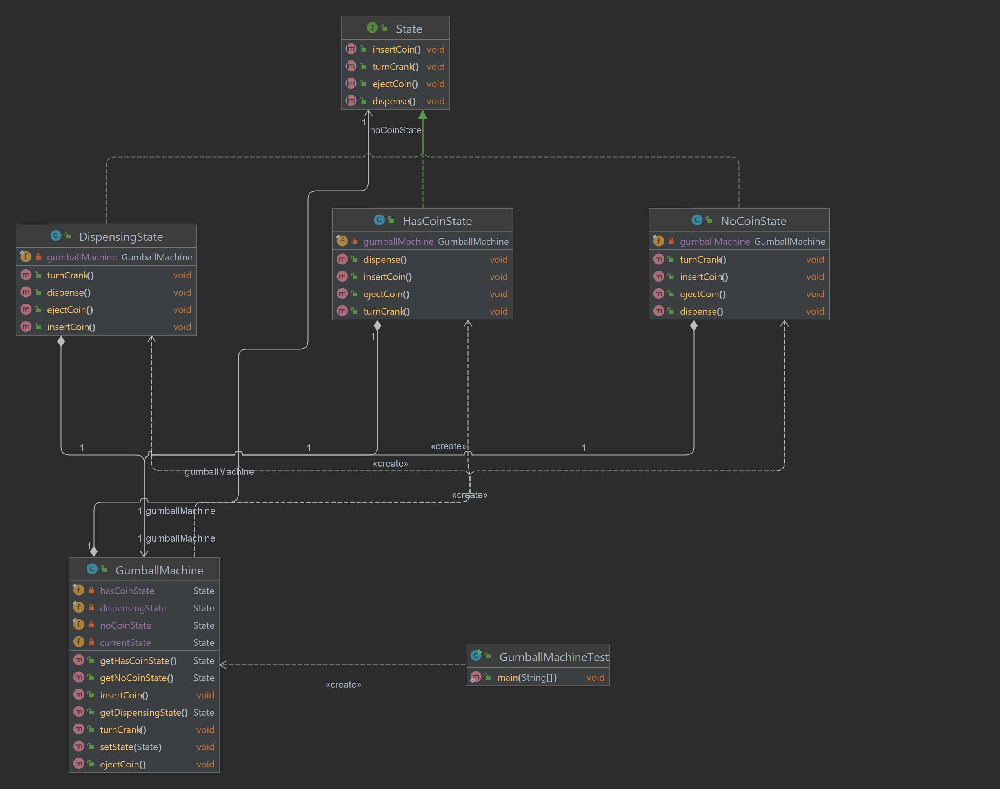

# Chapter 10: State Pattern - Managing Object States Dynamically

## What is the State Pattern?
The **State Pattern** is a behavioral design pattern that allows an object to alter its behavior when its internal state changes. It encapsulates state-specific behavior into separate state classes and delegates state-related work to an instance of these classes.

This pattern is often compared to a **finite state machine**, where the object can switch between predefined states based on events.

---

## Key Components of the State Pattern
1. **State Interface**:
    - Defines the common behavior for all concrete states.
2. **Concrete State Classes**:
    - Implement specific behaviors associated with each state.
3. **Context (Main Object)**:
    - Maintains a reference to the current state object and delegates requests to it.

---

## Why Use the State Pattern?
- **Encapsulation of State-Specific Behavior**: Keeps state-specific behavior separate from the context class.
- **Improved Maintainability**: Simplifies modifications by isolating changes to specific states.
- **Eliminates Conditional Logic**: Avoids large `if-else` or `switch` statements for state transitions.

---

## How It Works
1. Define a **State Interface** with methods that handle state-specific behavior.
2. Create **Concrete State Classes** that implement the state interface.
3. The **Context** class holds a reference to the current state and delegates requests to it.
4. State transitions are managed by the state classes or the context class.

---

## Project Structure
```
src/main/java/com/headfirst/chapter10/statePattern/
├── gumballmachine/
│   ├── State.java                    # State Interface
│   ├── NoCoinState.java              # Concrete State 1
│   ├── HasCoinState.java             # Concrete State 2
│   ├── DispensingState.java          # Concrete State 3
│   ├── GumballMachine.java           # Context
│   └── GumballMachineTest.java       # Client
└── trafficlight/
    ├── TrafficLightState.java        # State Interface
    ├── RedLightState.java            # Concrete State 1
    ├── GreenLightState.java          # Concrete State 2
    ├── YellowLightState.java         # Concrete State 3
    ├── TrafficLight.java             # Context
    └── TrafficLightTest.java         # Client

```

## Example: Gumball Machine
The classic gumball machine example illustrates how the State Pattern handles different states like "No Coin", "Has Coin", "Dispensing Gumball", etc.

### Class Diagram


### Example Code

#### **State Interface**
```java
public interface State {
    void insertCoin();
    void ejectCoin();
    void turnCrank();
    void dispense();
}
```
### **Concrete State 1: NoCoinState**
```java
public class NoCoinState implements State {
    private final GumballMachine gumballMachine;

    public NoCoinState(GumballMachine gumballMachine) {
        this.gumballMachine = gumballMachine;
    }

    @Override
    public void insertCoin() {
        System.out.println("Coin inserted. You can turn the crank now.");
        gumballMachine.setState(gumballMachine.getHasCoinState());
    }

    @Override
    public void ejectCoin() {
        System.out.println("No coin to eject.");
    }

    @Override
    public void turnCrank() {
        System.out.println("Insert a coin first.");
    }

    @Override
    public void dispense() {
        System.out.println("No gumball dispensed.");
    }
}
```

### **Concrete State 2: HasCoinState**

```java
public class HasCoinState implements State {
    private final GumballMachine gumballMachine;

    public HasCoinState(GumballMachine gumballMachine) {
        this.gumballMachine = gumballMachine;
    }

    @Override
    public void insertCoin() {
        System.out.println("Coin already inserted.");
    }

    @Override
    public void ejectCoin() {
        System.out.println("Coin ejected.");
        gumballMachine.setState(gumballMachine.getNoCoinState());
    }

    @Override
    public void turnCrank() {
        System.out.println("Crank turned. Dispensing gumball...");
        gumballMachine.setState(gumballMachine.getDispensingState());
    }

    @Override
    public void dispense() {
        System.out.println("Turn the crank to dispense.");
    }
}
```

### **Context: GumballMachine**
```java
public class GumballMachine {
    private final State noCoinState;
    private final State hasCoinState;
    private final State dispensingState;

    private State currentState;

    public GumballMachine() {
        noCoinState = new NoCoinState(this);
        hasCoinState = new HasCoinState(this);
        dispensingState = new DispensingState(this);

        currentState = noCoinState; // Initial state
    }

    public void setState(State state) {
        this.currentState = state;
    }

    public State getNoCoinState() {
        return noCoinState;
    }

    public State getHasCoinState() {
        return hasCoinState;
    }

    public State getDispensingState() {
        return dispensingState;
    }

    public void insertCoin() {
        currentState.insertCoin();
    }

    public void ejectCoin() {
        currentState.ejectCoin();
    }

    public void turnCrank() {
        currentState.turnCrank();
        currentState.dispense();
    }
}
```

### **Client**

```java
public class GumballMachineTest {
    public static void main(String[] args) {
        GumballMachine gumballMachine = new GumballMachine();

        gumballMachine.insertCoin();
        gumballMachine.turnCrank();

        gumballMachine.insertCoin();
        gumballMachine.ejectCoin();
    }
}
```

## Real-World Applications 🌍

### Example: Traffic Light System
The traffic light system is a real-world example of the State Pattern. It demonstrates how traffic lights transition between states like "Red", "Green", and "Yellow" while maintaining state-specific behavior.

### Class Diagram


---

## Example Code

### **State Interface**
```java
public interface TrafficLightState {
    void changeLight(TrafficLight context);
    void display();
}
```
### **Concrete State 1: RedLightState**
```java
/**
 * Red Light state implementation.
 */
public class RedLightState implements TrafficLightState {
    @Override
    public void changeLight(TrafficLight context) {
        System.out.println("Changing light to Green.");
        context.setState(new GreenLightState());
    }

    @Override
    public void display() {
        System.out.println("Red Light - STOP!");
    }
}
```
### **Concrete State 2: GreenLightState**
```java
/**
 * Green Light state implementation.
 */
public class GreenLightState implements TrafficLightState {
    @Override
    public void changeLight(TrafficLight context) {
        System.out.println("Changing light to Yellow.");
        context.setState(new YellowLightState());
    }

    @Override
    public void display() {
        System.out.println("Green Light - GO!");
    }
}
```
### **Concrete State 3: YellowLightState**
```java
/**
 * Yellow Light state implementation.
 */
public class YellowLightState implements TrafficLightState {
    @Override
    public void changeLight(TrafficLight context) {
        System.out.println("Changing light to Red.");
        context.setState(new RedLightState());
    }

    @Override
    public void display() {
        System.out.println("Yellow Light - SLOW DOWN!");
    }
}
```
### **Context: TrafficLight**
```java
/**
 * Context for managing traffic light states.
 */
public class TrafficLight {
    private TrafficLightState currentState;

    public TrafficLight() {
        currentState = new RedLightState(); // Initial state
    }

    public void setState(TrafficLightState state) {
        currentState = state;
    }

    public void changeLight() {
        currentState.changeLight(this);
    }

    public void display() {
        currentState.display();
    }
}

```

### **Client: TrafficLightTest**
```java
/**
 * Client to test the Traffic Light System using the State Pattern.
 */
public class TrafficLightTest {
    public static void main(String[] args) {
        TrafficLight trafficLight = new TrafficLight();

        trafficLight.display();
        trafficLight.changeLight();

        trafficLight.display();
        trafficLight.changeLight();
    }
}
```
---
## More Examples
1. ATMs: Handles states like "Card Inserted", "PIN Entered", "Transaction In Progress".
2. Media Players: Manages states like "Playing", "Paused", "Stopped".


## Summary Table
| **Component**    | **Responsibility**                               |
|------------------|-------------------------------------------------|
| State  Interface | Defines common behavior for all states                |
| Concrete State   | Implements specific behavior for each state    |
| Context          | Maintains current state and delegates behavior            |

The State Pattern is a powerful tool for managing objects with complex and dynamic state transitions. It eliminates conditional logic, improves code maintainability, and aligns well with real-world scenarios! 🚀
