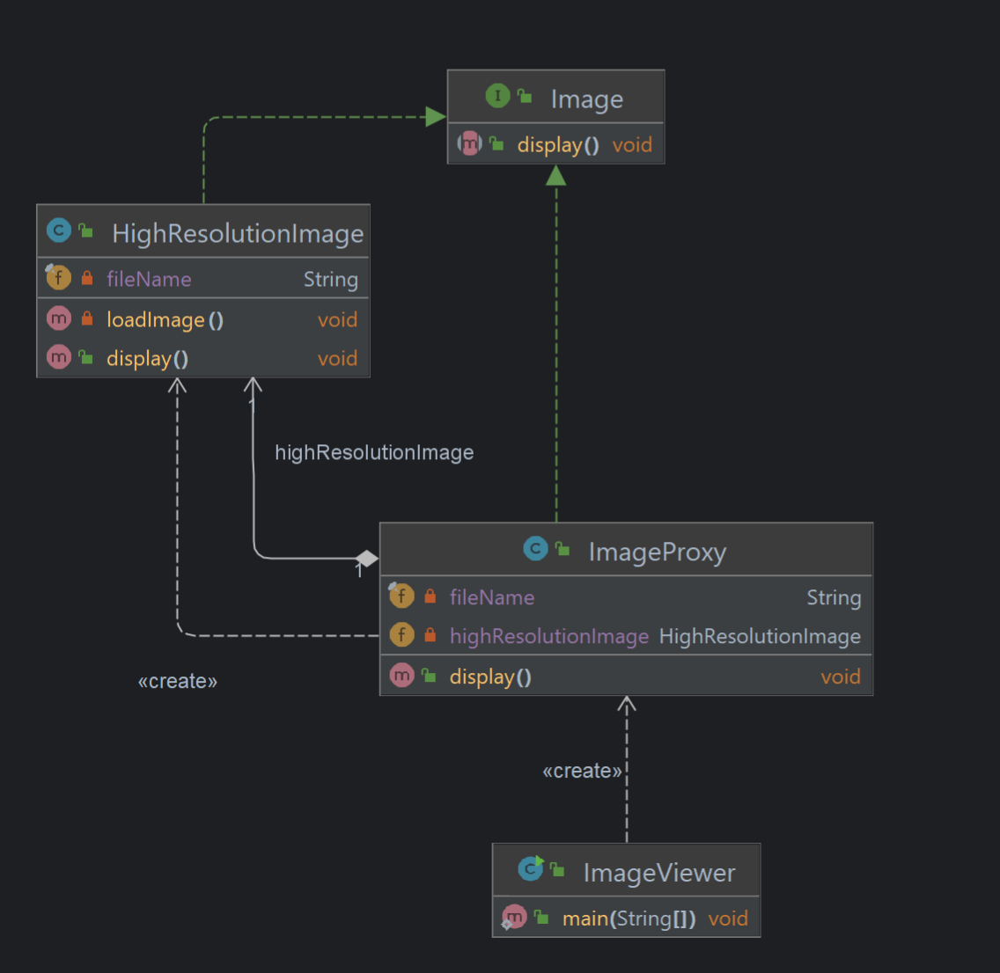
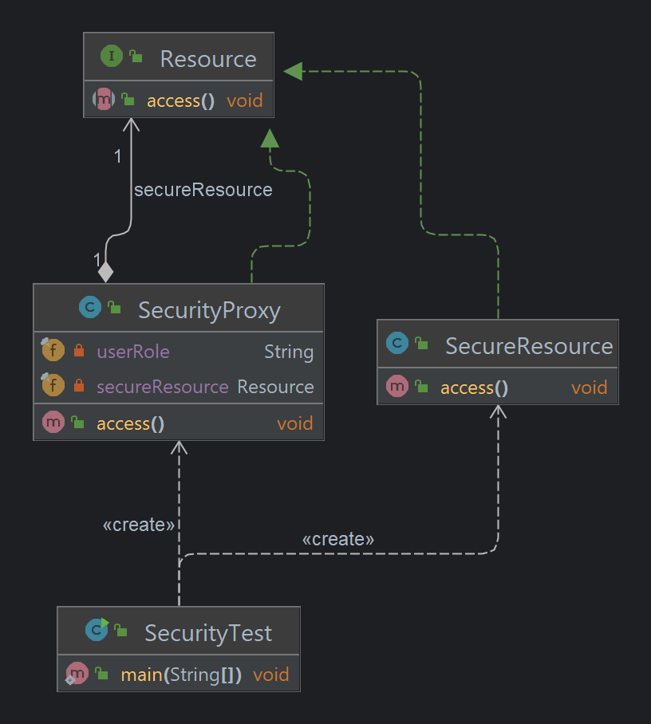

# Chapter 11: Proxy Pattern - Controlling Access to Objects

## What is the Proxy Pattern?
The **Proxy Pattern** is a structural design pattern that provides a surrogate or placeholder object to control access to another object. The proxy can act as an intermediary, adding functionality like access control, caching, or lazy initialization, without changing the original object.

---

## Key Components of the Proxy Pattern
1. **Subject Interface**:
    - Defines common operations that both the real object and the proxy must implement.
2. **Real Subject**:
    - The actual object that performs the core business logic.
3. **Proxy**:
    - Acts as a placeholder for the real subject and controls access to it.
4. **Client**:
    - Interacts with the proxy, unaware of whether it’s dealing with the real object or the proxy.

---

## Why Use the Proxy Pattern?
- **Access Control**: Restricts or manages access to the real object.
- **Performance Optimization**: Introduces lazy initialization or caching to optimize resource usage.
- **Remote Access**: Provides a local representative for accessing remote objects.
- **Security Enhancements**: Adds additional authentication or logging layers.

---

## Types of Proxies
1. **Remote Proxy**:
    - Represents an object located in a different address space.
    - Example: Java RMI (Remote Method Invocation).
2. **Virtual Proxy**:
    - Manages expensive objects and initializes them only when necessary.
    - Example: Lazy loading of large images in UI.
3. **Protection Proxy**:
    - Adds access control to ensure only authorized users can interact with the real object.
    - Example: Authentication for admin resources.

---
## Project Structure
```
src/main/java/com/headfirst/chapter11/proxyPattern/
├── imageviewer/
│   ├── Image.java                  # Subject Interface
│   ├── HighResolutionImage.java    # Real Subject
│   ├── ImageProxy.java             # Proxy
│   └── ImageViewer.java            # Client
└── security/
    ├── Resource.java               # Subject Interface
    ├── SecureResource.java         # Real Subject
    ├── SecurityProxy.java          # Proxy
    └── SecurityTest.java           # Client

```
---

## Example 1: Image Viewer with Virtual Proxy
The example illustrates how a proxy delays the loading of high-resolution images until they are displayed.

### Class Diagram



### Example Code

#### **Subject Interface**
```java
public interface Image {
    void display();
}
```

#### **Real Subject: HighResolutionImage**
```java
public class HighResolutionImage implements Image {
    private final String fileName;

    public HighResolutionImage(String fileName) {
        this.fileName = fileName;
        loadImage();
    }

    private void loadImage() {
        System.out.println("Loading high-resolution image: " + fileName);
    }

    @Override
    public void display() {
        System.out.println("Displaying: " + fileName);
    }
}

```

#### **Proxy: ImageProxy**
```java
public class ImageProxy implements Image {
    private final String fileName;
    private HighResolutionImage highResolutionImage;

    public ImageProxy(String fileName) {
        this.fileName = fileName;
    }

    @Override
    public void display() {
        if (highResolutionImage == null) {
            highResolutionImage = new HighResolutionImage(fileName);
        }
        highResolutionImage.display();
    }
}

```

#### **Client**
```java
public class ImageViewer {
    public static void main(String[] args) {
        Image image1 = new ImageProxy("photo1.jpg");
        Image image2 = new ImageProxy("photo2.jpg");

        System.out.println("Displaying images for the first time:");
        image1.display(); // Loads and displays
        image2.display(); // Loads and displays

        System.out.println("\nDisplaying images again:");
        image1.display(); // Displays without loading
        image2.display(); // Displays without loading
    }
}

```
---
## Example 2: Image Viewer with Virtual Proxy
### Class Diagram


#### **Resource**
```java
/**
 * Subject Interface for Resources.
 */
public interface Resource {
    void access();
}
```
#### **SecurityResource**
```java
/**
 * Real Subject for accessing a secure resource.
 */
public class SecureResource implements Resource {
    @Override
    public void access() {
        System.out.println("Accessing secure resource...");
    }
}

```
#### **SecurityProxy**
```java
/**
 * Proxy for role-based access control.
 */
public class SecurityProxy implements Resource {
    private final Resource secureResource;
    private final String userRole;

    public SecurityProxy(Resource secureResource, String userRole) {
        this.secureResource = secureResource;
        this.userRole = userRole;
    }

    @Override
    public void access() {
        if ("ADMIN".equals(userRole)) {
            secureResource.access();
        } else {
            System.out.println("Access denied! Admin role required.");
        }
    }
}

```
#### **SecurityTest**
```java
/**
 * Client to demonstrate Protection Proxy for secure resources.
 */
public class SecurityTest {
    public static void main(String[] args) {
        Resource adminResource = new SecurityProxy(new SecureResource(), "ADMIN");
        Resource userResource = new SecurityProxy(new SecureResource(), "USER");

        System.out.println("Admin trying to access resource:");
        adminResource.access();

        System.out.println("\nUser trying to access resource:");
        userResource.access();
    }
}
```

---
## Real-World Applications 🌍
1. Remote Proxy: Distributed systems, e.g., accessing remote servers via REST or RMI.
2. Virtual Proxy: Lazy initialization for UI components or objects that are resource-intensive.
3. Protection Proxy: Role-based access control, e.g., ensuring only authorized users can execute certain operations.


|Component   | Responsibility  |
|---|---|
|  Subject Interface | Defines common operations for Real and Proxy objects  |
|  Real Subject | Implements core functionality  |
| Proxy  |  Controls access and adds additional behavior |
| Client  | Interacts with the Subject interface  |

* The Proxy Pattern is a versatile tool for controlling access, optimizing performance, and adding security layers. Whether you're working on large-scale systems or designing resource-intensive applications, this pattern is indispensable. 🚀