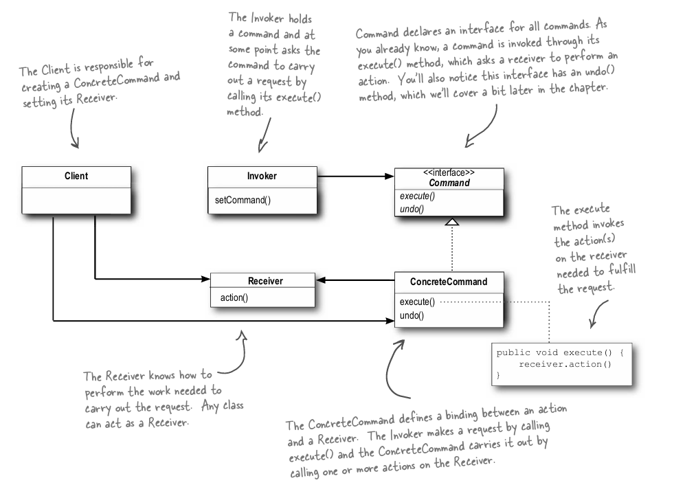

# Chapter 6: Command Pattern - Encapsulating Requests as Objects

## What is the Command Pattern?
The **Command Pattern** is a behavioral design pattern that encapsulates a request or action as an object. This allows you to:
- Parameterize objects with different requests or actions.
- Queue requests for later execution.
- Support undo and redo functionality.

The Command Pattern decouples the sender (Invoker) from the receiver, enabling flexibility in assigning, logging, and executing actions.

---

## Key Components of the Command Pattern
1. **Command Interface**:
    - Defines the `execute` method for all commands.
2. **Concrete Command**:
    - Implements the `Command` interface and contains the logic to invoke methods on the receiver.
3. **Invoker**:
    - Sends the request by calling the `execute` method of the command.
4. **Receiver**:
    - Performs the actual action when the command is executed.
5. **Client**:
    - Configures the invoker with the appropriate commands and sets up the receiver.
### Class Diagram
The class diagram consists of the following entities:

---

## Why Use the Command Pattern?
- **Decoupling**: Separates the sender (Invoker) from the receiver, making the system more flexible.
- **Encapsulation**: Encapsulates actions or requests as objects, making them easier to parameterize, log, or queue.
- **Undo/Redo Support**: Enables storing executed commands to support undo and redo operations.
- **Macro Commands**: Allows grouping multiple commands into a single command to perform complex operations.

---

## Real-World Example: Aircraft Landing Gear System
Consider the cockpit of an aircraft, where buttons control the landing gear. The **Command Pattern** allows the button (Invoker) to trigger actions without knowing how the landing gear (Receiver) operates.


### Example Code

```
src/main/java/com/headfirst/chapter6/commandPattern/aircraft/
├── Command.java               # Command Interface
├── LandingGear.java           # Receiver Class
├── LandingGearDownCommand.java # Concrete Command
├── LandingGearUpCommand.java  # Concrete Command
├── InstrumentPanel.java       # Invoker Class
└── AircraftSimulator.java     # Client Code
```

#### **Command Interface**
```java
public interface Command {
    void execute();
}
```

#### **Concrete Command**
```java
public class LandingGearDownCommand implements Command {
    private LandingGear landingGear;

    public LandingGearDownCommand(LandingGear landingGear) {
        this.landingGear = landingGear;
    }

    @Override
    public void execute() {
        landingGear.down();
    }
}

public class LandingGearUpCommand implements Command {
    private LandingGear landingGear;

    public LandingGearUpCommand(LandingGear landingGear) {
        this.landingGear = landingGear;
    }

    @Override
    public void execute() {
        landingGear.up();
    }
}
```

#### **Receiver**
```java
public class LandingGear {
    public void up() {
        System.out.println("Landing gear is retracted.");
    }

    public void down() {
        System.out.println("Landing gear is lowered.");
    }
}
```

#### **Invoker**
```java
public class InstrumentPanel {
    private Command[] commands = new Command[2];

    public void setCommand(int index, Command command) {
        commands[index] = command;
    }

    public void pressButton(int index) {
        if (commands[index] != null) {
            commands[index].execute();
        }
    }
}
```

#### **Client**
```java
public class AircraftSimulator {
    public static void main(String[] args) {
        LandingGear landingGear = new LandingGear();

        // Create commands
        Command gearUpCommand = new LandingGearUpCommand(landingGear);
        Command gearDownCommand = new LandingGearDownCommand(landingGear);

        // Set up instrument panel (Invoker)
        InstrumentPanel panel = new InstrumentPanel();
        panel.setCommand(0, gearUpCommand);
        panel.setCommand(1, gearDownCommand);

        // Simulate button presses
        panel.pressButton(1); // Lower landing gear
        panel.pressButton(0); // Retract landing gear
    }
}
```

---

## Example from *Head First Design Patterns*
```
src/main/java/com/headfirst/chapter6/commandPattern/remotecontrol/
├── Command.java               # Command Interface
├── Light.java                 # Receiver Class
├── LightOnCommand.java        # Concrete Command
├── LightOffCommand.java       # Concrete Command
├── RemoteControl.java         # Invoker Class
└── RemoteLoader.java          # Client Code
```
### **Remote Control Example**

#### **Command Interface**
```java
public interface Command {
    void execute();
}
```

#### **Concrete Commands**
```java
public class LightOnCommand implements Command {
    private Light light;

    public LightOnCommand(Light light) {
        this.light = light;
    }

    @Override
    public void execute() {
        light.on();
    }
}

public class LightOffCommand implements Command {
    private Light light;

    public LightOffCommand(Light light) {
        this.light = light;
    }

    @Override
    public void execute() {
        light.off();
    }
}
```

#### **Receiver**
```java
public class Light {
    public void on() {
        System.out.println("Light is ON");
    }

    public void off() {
        System.out.println("Light is OFF");
    }
}
```

#### **Invoker**
```java
public class RemoteControl {
    private Command[] onCommands;
    private Command[] offCommands;

    public RemoteControl() {
        onCommands = new Command[7];
        offCommands = new Command[7];
    }

    public void setCommand(int slot, Command onCommand, Command offCommand) {
        onCommands[slot] = onCommand;
        offCommands[slot] = offCommand;
    }

    public void onButtonPressed(int slot) {
        onCommands[slot].execute();
    }

    public void offButtonPressed(int slot) {
        offCommands[slot].execute();
    }
}
```

#### **Client**
```java
public class RemoteLoader {
    public static void main(String[] args) {
        RemoteControl remote = new RemoteControl();
        Light livingRoomLight = new Light();

        LightOnCommand lightOn = new LightOnCommand(livingRoomLight);
        LightOffCommand lightOff = new LightOffCommand(livingRoomLight);

        remote.setCommand(0, lightOn, lightOff);

        remote.onButtonPressed(0);
        remote.offButtonPressed(0);
    }
}
```

---

## Advanced Features
### Macro Command
A **Macro Command** is a composite command that sequences multiple commands to execute them together.

```java
public class MacroCommand implements Command {
    private List<Command> commands = new ArrayList<>();

    public void addCommand(Command command) {
        commands.add(command);
    }

    @Override
    public void execute() {
        for (Command command : commands) {
            command.execute();
        }
    }
}
```
**Usage Example**:
```java
MacroCommand macro = new MacroCommand();
macro.addCommand(new LandingGearDownCommand(landingGear));
macro.addCommand(new LightOnCommand(light));
macro.execute();
```

### Undo/Redo
The **Command Interface** can be extended with an `undo` method:
```java
public interface Command {
    void execute();
    void undo();
}
```

Executed commands can be stored in a stack for undo functionality.

---

## Other Applications 🌍
1. **Home Automation Systems**: Assigning actions to remote control buttons.
2. **Task Scheduling**: Queueing commands for execution later.
3. **GUI Applications**: Attaching actions to buttons dynamically.
4. **Logging and Replay**: Logging commands to re-execute them after a crash.
5. **Undo/Redo**: Text editors or graphics software to undo and redo actions.
6. **Macro Commands**: Combining multiple commands for complex actions.

---

## Summary Table
| **Component**      | **Responsibility**                                 |
|--------------------|---------------------------------------------------|
| Command            | Encapsulates a request or action as an object     |
| Concrete Command   | Implements the `Command` interface                |
| Receiver           | Knows how to perform the operation                |
| Invoker            | Calls the `execute` method on a command           |
| Client             | Configures commands and sets them on the invoker  |

---

## How to Use the Command Pattern
1. Clone the repository:
   ```bash
   git clone https://github.com/tamimdalwai/HeadFirstDesignPatterns
   ```
2. Navigate to the Command Pattern examples:
   ```bash
   cd src/main/java/com/headfirst/chapter6/commandPattern
   ```
3. Run the `AircraftSimulator` or `RemoteLoader` class to see the Command Pattern in action.

---

The Command Pattern provides flexibility and decoupling by encapsulating requests as objects. It’s particularly useful for undo/redo functionality, macro commands, and dynamic action assignment. 🚀

