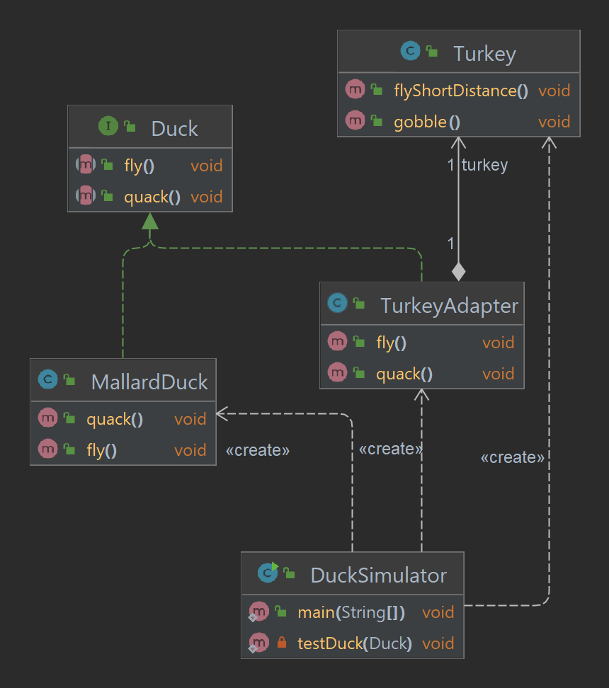
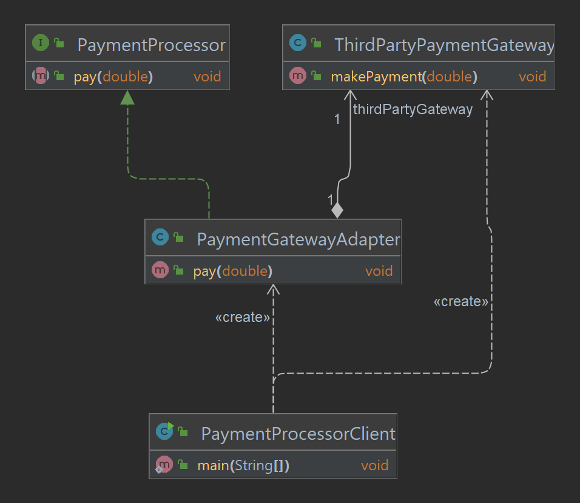

# Chapter 7: Adapter Pattern - Bridging the Gap

## What is the Adapter Pattern?
The **Adapter Pattern** is a structural design pattern that allows objects with incompatible interfaces to work together. It acts as a bridge, converting one interface into another expected by the client.

The Adapter Pattern is particularly useful when integrating new components into an existing system without modifying its codebase.

---

## Key Components of the Adapter Pattern
1. **Target Interface**: The interface expected by the client.
2. **Adapter**: The class that bridges the gap between the Target Interface and the Adaptee.
3. **Adaptee**: The class that needs to be adapted to work with the Target Interface.
4. **Client**: The class that interacts with the Target Interface.

---

## Why Use the Adapter Pattern?
- **Reusability**: Reuse existing functionality by adapting its interface.
- **Flexibility**: Integrate third-party or legacy code into a new system.
- **Decoupling**: Decouples the client from specific implementations of the Adaptee.

---

## How It Works
1. Define the **Target Interface** that the client expects.
2. Create the **Adaptee** class, which has an incompatible interface.
3. Implement the **Adapter** class to bridge the gap by implementing the Target Interface and delegating calls to the Adaptee.
4. The **Client** interacts only with the Target Interface.

---

## Example: Duck Adapter
Consider a scenario where a client expects a `Duck` interface but we need to adapt a `Turkey` class to fit into this system.

### Project Structure
```
src/main/java/com/headfirst/chapter7/adapterPattern/
├── duck/
│   ├── Duck.java                     # Target Interface
│   ├── MallardDuck.java              # Duck Implementation
│   ├── Turkey.java                   # Adaptee
│   ├── TurkeyAdapter.java            # Adapter
│   └── DuckSimulator.java            # Client
├── payment/
│   ├── PaymentProcessor.java         # Target Interface
│   ├── ThirdPartyPaymentGateway.java # Adaptee
│   ├── PaymentGatewayAdapter.java    # Adapter
│   └── PaymentProcessorClient.java   # Client
```

### Class Diagram




### Example Code

#### **Target Interface**
```java
public interface Duck {
    void quack();
    void fly();
}
```

#### **Adaptee**
```java
public class Turkey {
    public void gobble() {
        System.out.println("Turkey gobbles!");
    }

    public void flyShortDistance() {
        System.out.println("Turkey flies a short distance.");
    }
}
```

#### **Adapter**
```java
public class TurkeyAdapter implements Duck {
    private final Turkey turkey;

    public TurkeyAdapter(Turkey turkey) {
        this.turkey = turkey;
    }

    @Override
    public void quack() {
        turkey.gobble();
    }

    @Override
    public void fly() {
        for (int i = 0; i < 5; i++) {
            turkey.flyShortDistance();
        }
    }
}
```

#### **Client**
```java
public class DuckSimulator {
    public static void main(String[] args) {
        Duck mallardDuck = new MallardDuck();
        Turkey wildTurkey = new Turkey();
        Duck turkeyAdapter = new TurkeyAdapter(wildTurkey);

        System.out.println("The Turkey says...");
        wildTurkey.gobble();
        wildTurkey.flyShortDistance();

        System.out.println("\nThe Duck says...");
        testDuck(mallardDuck);

        System.out.println("\nThe TurkeyAdapter says...");
        testDuck(turkeyAdapter);
    }

    private static void testDuck(Duck duck) {
        duck.quack();
        duck.fly();
    }
}
```

---

## Real-World Applications 🌍


### Class Diagram



### Example 1: Payment Gateways
Imagine integrating a third-party payment processor into an existing e-commerce platform. The **Adapter** can map the existing payment interface to the third-party API, ensuring seamless integration.

#### **Target Interface**
```java
public interface PaymentProcessor {
    void pay(double amount);
}
```

#### **Adaptee**
```java
// Third-party payment gateway with a different API
public class ThirdPartyPaymentGateway {
    public void makePayment(double amountInDollars) {
        System.out.println("Payment of $" + amountInDollars + " made via Third-Party Gateway.");
    }
}
```

#### **Adapter**
```java
// Adapter to bridge the common interface and third-party gateway
public class PaymentGatewayAdapter implements PaymentProcessor {
    private final ThirdPartyPaymentGateway thirdPartyGateway;

    public PaymentGatewayAdapter(ThirdPartyPaymentGateway thirdPartyGateway) {
        this.thirdPartyGateway = thirdPartyGateway;
    }

    @Override
    public void pay(double amount) {
        thirdPartyGateway.makePayment(amount);
    }
}
```

#### **Client**
```java
public class PaymentProcessorClient {
    public static void main(String[] args) {
        // Adaptee: Third-party payment gateway
        ThirdPartyPaymentGateway thirdPartyGateway = new ThirdPartyPaymentGateway();

        // Adapter: Adapts the third-party gateway to the common interface
        PaymentProcessor paymentProcessor = new PaymentGatewayAdapter(thirdPartyGateway);

        // Client: Uses the common PaymentProcessor interface
        paymentProcessor.pay(150.75); // Payment of $150.75 made via Third-Party Gateway.
    }
}
```

### Example 2: File Format Conversions
When working with different file formats (e.g., XML and JSON), an **Adapter** can translate one format to another, enabling compatibility between systems.

### Example 3: Legacy System Integration
Legacy systems often use outdated interfaces. The **Adapter** bridges these older interfaces with modern applications, allowing them to work together without modifying the legacy code.

---

## Summary Table
| **Component**      | **Responsibility**                                |
|--------------------|--------------------------------------------------|
| Target Interface   | Defines the expected interface                   |
| Adapter            | Bridges the gap between Target and Adaptee       |
| Adaptee            | The incompatible class being adapted             |
| Client             | Uses the Target Interface                        |

---

The Adapter Pattern is your go-to solution for making incompatible interfaces work together seamlessly. It’s an essential tool for modernizing legacy systems and integrating external libraries. 🚀


