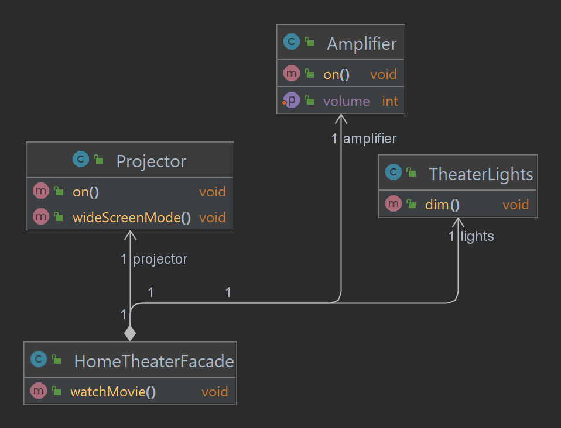

# Chapter 7: Facade Pattern - Simplifying Interactions

## What is the Facade Pattern?
The **Facade Pattern** is a structural design pattern that provides a simplified interface to a larger body of code, hiding the complexities of the subsystems behind it.

The Facade acts as a high-level interface that makes a subsystem easier to use, allowing clients to interact with the system through the facade instead of dealing with its complex structure.

---

## Key Components of the Facade Pattern
1. **Facade**: Provides a simplified interface to the subsystems.
2. **Subsystems**: Complex components or services that the Facade simplifies.
3. **Client**: Interacts with the Facade rather than the subsystems directly.

---

## Why Use the Facade Pattern?
- **Simplified Interface**: Provides an easy-to-use interface for clients.
- **Loose Coupling**: Decouples clients from complex subsystem implementations.
- **Improved Maintainability**: Changes in subsystems are isolated from the client.

---

## How It Works
1. Identify subsystems that need simplification.
2. Create a **Facade** class that provides high-level methods to interact with the subsystems.
3. Use the Facade in the client to hide subsystem complexities.

---

## Example: Home Theater System
Consider a complex home theater system with multiple components such as an amplifier, projector, lights, and speakers. The Facade Pattern simplifies the process of turning on the theater.

### Project Structure
```
src/main/java/com/headfirst/chapter7/facadePattern/
├── subsystems/
│   ├── Amplifier.java           # Subsystem: Amplifier
│   ├── Projector.java           # Subsystem: Projector
│   ├── TheaterLights.java       # Subsystem: Theater Lights
├   ├── HomeTheaterFacade.java   # Facade Class
└── HomeTheaterTest.java         # Client

```

### Class Diagram



### Example Code

#### **Subsystems**
```java
public class Amplifier {
    public void on() {
        System.out.println("Amplifier is ON");
    }

    public void setVolume(int level) {
        System.out.println("Setting volume to " + level);
    }
}

public class Projector {
    public void on() {
        System.out.println("Projector is ON");
    }

    public void wideScreenMode() {
        System.out.println("Setting projector to widescreen mode");
    }
}

public class TheaterLights {
    public void dim() {
        System.out.println("Dimming theater lights");
    }
}
```

#### **Facade**
```java
public class HomeTheaterFacade {
    private final Amplifier amplifier;
    private final Projector projector;
    private final TheaterLights lights;

    public HomeTheaterFacade(Amplifier amplifier, Projector projector, TheaterLights lights) {
        this.amplifier = amplifier;
        this.projector = projector;
        this.lights = lights;
    }

    public void watchMovie() {
        System.out.println("Getting ready to watch a movie...");
        lights.dim();
        amplifier.on();
        amplifier.setVolume(10);
        projector.on();
        projector.wideScreenMode();
        System.out.println("Movie is starting!");
    }
}
```

#### **Client**
```java
public class HomeTheaterTest {
    public static void main(String[] args) {
        Amplifier amplifier = new Amplifier();
        Projector projector = new Projector();
        TheaterLights lights = new TheaterLights();

        HomeTheaterFacade homeTheater = new HomeTheaterFacade(amplifier, projector, lights);
        homeTheater.watchMovie();
    }
}
```

---

## Real-World Applications 🌍
### Example 1: Simplifying API Usage
Imagine integrating a complex third-party API that involves multiple classes and configurations. A **Facade** can wrap the intricate details into simple methods, such as:
- `initPaymentGateway()`
- `processTransaction()`
  This simplifies the developer experience, reducing errors and improving productivity.

### Example 2: Library Wrappers
Consider a graphics library where rendering an image requires multiple steps, such as setting up a canvas, loading resources, and drawing shapes. A **Facade** can provide a method like `renderImage(String filePath)` that handles everything internally.

### Example 3: Subsystem Management
In enterprise software, a Facade can simplify access to subsystems like authentication, logging, and notification services. For example, a `UserManagementFacade` can provide methods like `registerUser()` and `sendWelcomeEmail()`, hiding complex interactions with multiple subsystems.

---

## Summary Table
| **Component**      | **Responsibility**                              |
|--------------------|------------------------------------------------|
| Facade             | Simplifies interaction with subsystems         |
| Subsystems         | Perform the actual operations                  |
| Client             | Uses the Facade to interact with the subsystems|

---

The Facade Pattern is perfect for creating a simplified interface for complex subsystems, improving usability and maintainability. 🚀

