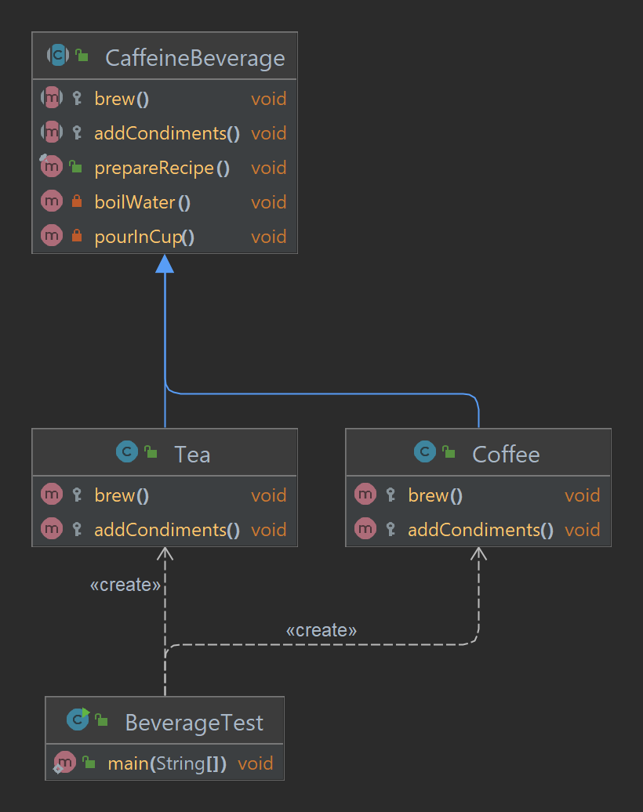
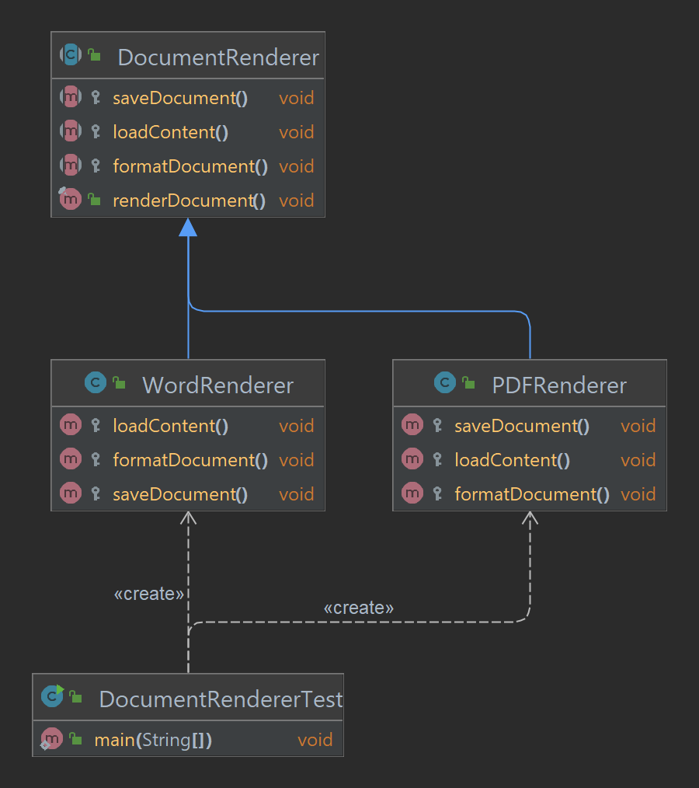

# Chapter 8: Template Method Pattern - Defining the Skeleton of an Algorithm

## What is the Template Method Pattern?
The **Template Method Pattern** is a behavioral design pattern that defines the skeleton of an algorithm in a base class but allows subclasses to customize certain steps. This ensures code reuse while maintaining flexibility for subclass-specific behavior.

The key idea is to encapsulate the invariant parts of the algorithm in a base class and delegate the variant parts to subclasses.

---

## Key Components of the Template Method Pattern
1. **Abstract Class**:
    - Contains the template method, which defines the structure of the algorithm.
    - Includes concrete methods for common functionality and abstract methods for steps that need customization.
2. **Concrete Subclasses**:
    - Override the abstract methods to provide specific behavior for the customizable steps.

---

## Why Use the Template Method Pattern?
- **Code Reuse**: Encapsulates common logic in a base class to avoid duplication.
- **Enforces Structure**: Ensures all subclasses follow a consistent algorithm structure.
- **Customizable Behavior**: Allows subclasses to implement specific steps while adhering to the overall algorithm.

---

## Caveats
- **Difference from Strategy Pattern**: The Template Method Pattern uses inheritance to vary parts of the algorithm, while the Strategy Pattern uses composition to encapsulate entire algorithms as interchangeable objects.
- **Relation to Factory Method Pattern**: The Factory Method Pattern can be viewed as a specialization of the Template Method Pattern, focusing specifically on object creation.
- **Minimize Subclass Requirements**: To maintain simplicity, ensure the abstract class minimizes the number of methods that subclasses need to implement.

---

## How It Works
1. Define an abstract class with the **template method** (final) that specifies the algorithm's structure.
2. Add concrete methods for common behavior in the base class.
3. Define abstract methods for steps that need subclass-specific behavior.
4. Subclasses override the abstract methods to provide custom implementations.

---

```
### Project Structure
src/main/java/com/headfirst/chapter8/templateMethodPattern/
├── beverage/
│   ├── CaffeineBeverage.java         # Abstract Class
│   ├── Coffee.java                   # Concrete Subclass
│   ├── Tea.java                      # Concrete Subclass
│   ├── BeverageTest.java             # Client
├── document/
│   ├── DocumentRenderer.java         # Abstract Class
│   ├── PDFRenderer.java              # Concrete Subclass
│   ├── WordRenderer.java             # Concrete Subclass
│   ├── DocumentRendererTest.java     # Client

```

## Example: Coffee and Tea Preparation
Consider a scenario where both coffee and tea preparation follow a common sequence: boiling water, brewing, pouring into a cup, and adding condiments. The steps for brewing and adding condiments vary between coffee and tea.

### Class Diagram




### Example Code

#### **Abstract Class**
```java
public abstract class CaffeineBeverage {

    // Template method - defines the algorithm structure
    public final void prepareRecipe() {
        boilWater();
        brew();
        pourInCup();
        addCondiments();
    }

    // Common step with default implementation
    private void boilWater() {
        System.out.println("Boiling water");
    }

    // Common step with default implementation
    private void pourInCup() {
        System.out.println("Pouring into cup");
    }

    // Steps to be customized by subclasses
    protected abstract void brew();
    protected abstract void addCondiments();
}
```

#### **Concrete Subclass 1: Tea**
```java
public class Tea extends CaffeineBeverage {
    @Override
    protected void brew() {
        System.out.println("Steeping the tea");
    }

    @Override
    protected void addCondiments() {
        System.out.println("Adding lemon");
    }
}
```

#### **Concrete Subclass 2: Coffee**
```java
public class Coffee extends CaffeineBeverage {
    @Override
    protected void brew() {
        System.out.println("Dripping coffee through filter");
    }

    @Override
    protected void addCondiments() {
        System.out.println("Adding sugar and milk");
    }
}
```

#### **Client**
```java
public class BeverageTest {
    public static void main(String[] args) {
        CaffeineBeverage tea = new Tea();
        CaffeineBeverage coffee = new Coffee();

        System.out.println("Making tea:");
        tea.prepareRecipe();

        System.out.println("\nMaking coffee:");
        coffee.prepareRecipe();
    }
}
```

---

## Example : Sorting Arrays
The Template Method Pattern is used in Java's `Arrays.sort()` method for custom sorting logic. It allows developers to provide their own sorting behavior using the `Comparable` interface.

### Example Code

#### **Abstract Class: Comparable Interface**
```java
public interface Comparable<T> {
    int compareTo(T o);
}
```

#### **Concrete Class 1: String Length Comparator**
```java
import java.util.Arrays;

public class StringLengthComparator implements Comparable<String> {
    private final String value;

    public StringLengthComparator(String value) {
        this.value = value;
    }

    @Override
    public int compareTo(String other) {
        return Integer.compare(value.length(), other.length());
    }

    @Override
    public String toString() {
        return value;
    }

    public static void main(String[] args) {
        String[] strings = {"apple", "banana", "pear", "fig"};

        Arrays.sort(strings, (a, b) -> Integer.compare(a.length(), b.length()));

        System.out.println("Sorted by length: " + Arrays.toString(strings));
    }
}
```

---

## Real-World Example: Document Rendering
Rendering documents in various formats (e.g., PDF, Word, HTML) can follow a common sequence:
1. Load content.
2. Format the document.
3. Save to the required format.


### Class Diagram



### Example Code

#### **Abstract Class: DocumentRenderer**
```java
public abstract class DocumentRenderer {

    // Template method
    public final void renderDocument() {
        loadContent();
        formatDocument();
        saveDocument();
    }

    protected abstract void loadContent();
    protected abstract void formatDocument();
    protected abstract void saveDocument();
}
```

#### **Concrete Subclass 1: PDFRenderer**
```java
public class PDFRenderer extends DocumentRenderer {
    @Override
    protected void loadContent() {
        System.out.println("Loading PDF content");
    }

    @Override
    protected void formatDocument() {
        System.out.println("Formatting PDF document");
    }

    @Override
    protected void saveDocument() {
        System.out.println("Saving as PDF");
    }
}
```

#### **Concrete Subclass 2: WordRenderer**
```java
public class WordRenderer extends DocumentRenderer {
    @Override
    protected void loadContent() {
        System.out.println("Loading Word content");
    }

    @Override
    protected void formatDocument() {
        System.out.println("Formatting Word document");
    }

    @Override
    protected void saveDocument() {
        System.out.println("Saving as Word");
    }
}
```

#### **Client**
```java
public class DocumentRendererTest {
    public static void main(String[] args) {
        DocumentRenderer pdfRenderer = new PDFRenderer();
        DocumentRenderer wordRenderer = new WordRenderer();

        System.out.println("Rendering PDF document:");
        pdfRenderer.renderDocument();

        System.out.println("\nRendering Word document:");
        wordRenderer.renderDocument();
    }
}
```

---

## Summary Table
| **Component**      | **Responsibility**                                |
|--------------------|--------------------------------------------------|
| Abstract Class     | Defines the template method and common steps      |
| Template Method    | Specifies the algorithm structure                 |
| Concrete Subclass  | Implements subclass-specific behavior             |

---

The **Template Method Pattern** provides a structured way to enforce consistency while allowing customization. It’s ideal for algorithms with common steps but varying details. 🚀

