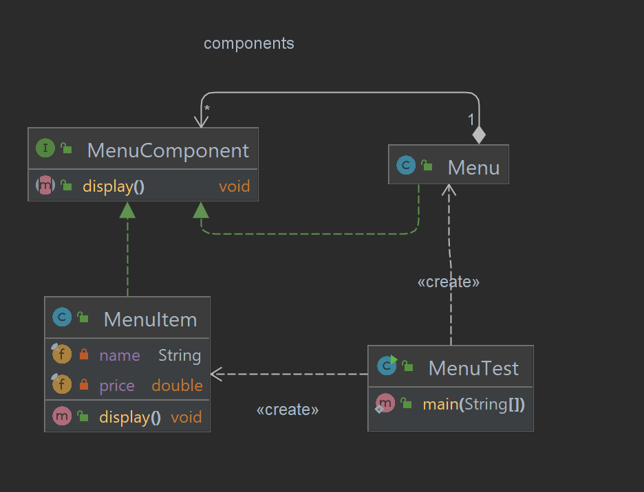
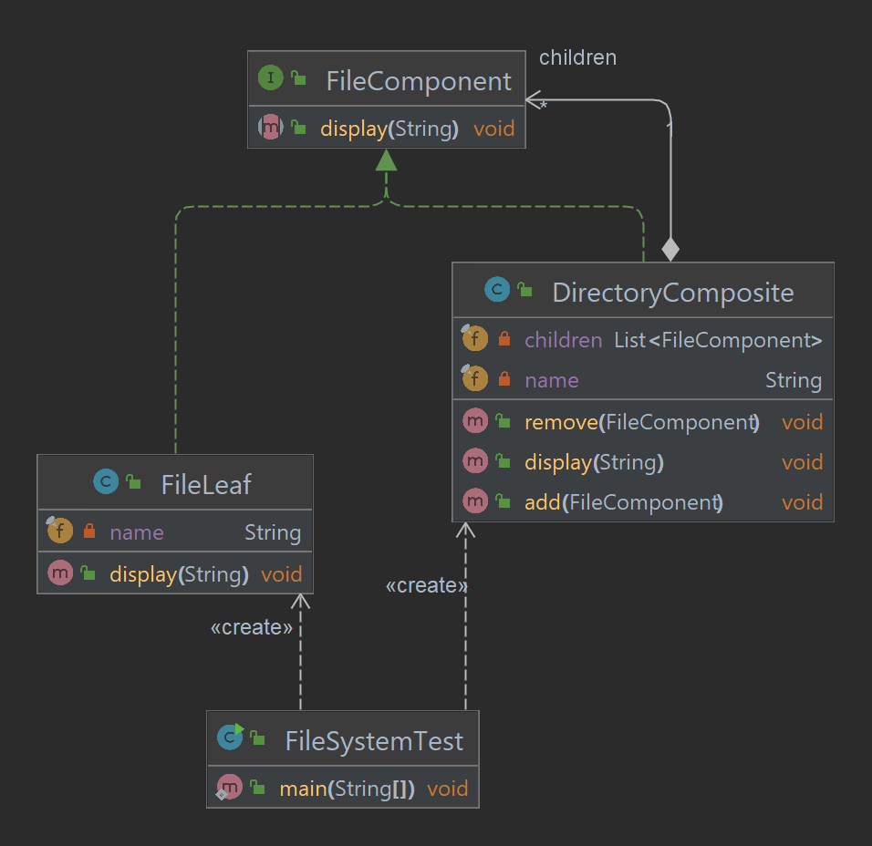

# Chapter 9: Composite Pattern - Managing Hierarchies

## What is the Composite Pattern?
The **Composite Pattern** is a structural design pattern that allows you to compose objects into tree structures to represent part-whole hierarchies. It lets clients treat individual objects and compositions of objects uniformly.

This is especially useful when dealing with recursive structures such as file systems, graphical UI components, or organizational hierarchies.

---

## Key Components of the Composite Pattern
1. **Component Interface**:
    - Defines the common interface for all objects in the hierarchy.
2. **Leaf**:
    - Represents individual objects with no children.
3. **Composite**:
    - Represents objects that can hold other objects (both Leaf and Composite).
4. **Client**:
    - Interacts with objects through the Component interface.

---

## Why Use the Composite Pattern?
- **Uniformity**: Treats individual and composite objects the same way.
- **Flexibility**: Easily adds new types of components or modifies the structure.
- **Scalability**: Handles complex hierarchical structures without modifying client code.

---

## How It Works
1. Define a **Component Interface** with common methods for both Leafs and Composites.
2. Implement the **Leaf** class for objects that do not have children.
3. Implement the **Composite** class for objects that can contain other components.
4. Use the **Client** to interact with the Component interface.

---

## Project Structure
```
src/main/java/com/headfirst/chapter9/iterator_compositePattern/composite
├── menu/
│   ├── MenuComponent.java        # Component Interface
│   ├── MenuItem.java             # Leaf
│   ├── Menu.java                 # Composite
│   └── MenuTest.java             # Client
└── filesystem/
    ├── FileComponent.java        # Component Interface
    ├── FileLeaf.java             # Leaf
    ├── DirectoryComposite.java   # Composite
    ├── FileSystemTest.java       # Client
```

## Example: Menu Hierarchy
Consider a restaurant menu system where each menu can contain menu items (Leaf) or other menus (Composite). Clients can traverse the entire hierarchy uniformly.

### Class Diagram



### Example Code

#### **Component Interface**
```java
public interface MenuComponent {
    void display();
}
```

#### **Leaf**
```java
public class MenuItem implements MenuComponent {
    private final String name;
    private final double price;

    public MenuItem(String name, double price) {
        this.name = name;
        this.price = price;
    }

    @Override
    public void display() {
        System.out.println("Item: " + name + ", Price: $" + price);
    }
}
```

#### **Composite**
```java
import java.util.ArrayList;
import java.util.List;

public class Menu implements MenuComponent {
    private final String name;
    private final List<MenuComponent> components = new ArrayList<>();

    public Menu(String name) {
        this.name = name;
    }

    public void add(MenuComponent component) {
        components.add(component);
    }

    public void remove(MenuComponent component) {
        components.remove(component);
    }

    @Override
    public void display() {
        System.out.println("Menu: " + name);
        for (MenuComponent component : components) {
            component.display();
        }
    }
}
```

#### **Client**
```java
public class MenuTest {
    public static void main(String[] args) {
        // Create individual menu items
        MenuComponent pancake = new MenuItem("Pancake", 5.99);
        MenuComponent waffle = new MenuItem("Waffle", 6.99);
        MenuComponent coffee = new MenuItem("Coffee", 2.99);

        // Create breakfast menu and add items
        MenuComponent breakfastMenu = new Menu("Breakfast Menu");
        breakfastMenu.add(pancake);
        breakfastMenu.add(waffle);

        // Create main menu and add sub-menus and items
        MenuComponent mainMenu = new Menu("Main Menu");
        mainMenu.add(breakfastMenu);
        mainMenu.add(coffee);

        // Display the entire menu hierarchy
        mainMenu.display();
    }
}
```

---

## Real-World Applications 🌍
### Example: File Systems
File systems consist of folders (Composite) that can contain files (Leaf) or other folders. The Composite Pattern allows clients to treat files and folders uniformly.

### Class Diagram

### Example Code
### **File Component**
```java
package com.headfirst.chapter9.iterator_compositePattern.composite.filesystem;

/**
 * Component interface for files and directories.
 */
public interface FileComponent {
    void display(String indent);
}

```

### **File Leaf**
```java
package com.headfirst.chapter9.iterator_compositePattern.composite.filesystem;


/**
 * Leaf class representing a file.
 */
public class FileLeaf implements FileComponent {
    private final String name;

    public FileLeaf(String name) {
        this.name = name;
    }

    @Override
    public void display(String indent) {
        System.out.println(indent + "File: " + name);
    }
}
```

### **Directory Composite**
```java
package com.headfirst.chapter9.iterator_compositePattern.composite.filesystem;

import java.util.ArrayList;
import java.util.List;

/**
 * Composite class representing a directory.
 */
public class DirectoryComposite implements FileComponent {
    private final String name;
    private final List<FileComponent> children = new ArrayList<>();

    public DirectoryComposite(String name) {
        this.name = name;
    }

    public void add(FileComponent component) {
        children.add(component);
    }

    public void remove(FileComponent component) {
        children.remove(component);
    }

    @Override
    public void display(String indent) {
        System.out.println(indent + "Directory: " + name);
        for (FileComponent child : children) {
            child.display(indent + "  ");
        }
    }
}
```

### **File System Test**
```java
package com.headfirst.chapter9.iterator_compositePattern.composite.filesystem;

/**
 * Client class to test the Composite Pattern for a file system.
 */
public class FileSystemTest {
    public static void main(String[] args) {
        // Create files
        FileComponent file1 = new FileLeaf("file1.txt");
        FileComponent file2 = new FileLeaf("file2.txt");
        FileComponent file3 = new FileLeaf("file3.txt");

        // Create directories and add files
        DirectoryComposite root = new DirectoryComposite("root");
        DirectoryComposite subDir1 = new DirectoryComposite("subDir1");
        DirectoryComposite subDir2 = new DirectoryComposite("subDir2");

        subDir1.add(file1);
        subDir1.add(file2);

        subDir2.add(file3);

        root.add(subDir1);
        root.add(subDir2);

        // Display the entire file system hierarchy
        root.display("");
    }
}
```
## More Examples
### Example 1: GUI Components
Graphical UI frameworks often have components like panels (Composite) that can contain other components (e.g., buttons, text fields) or panels.

### Example 2: Organizational Hierarchies
Organizations have managers (Composite) with subordinates (Leaf or Composite), enabling uniform operations like calculating salaries or printing reports.

---

## Summary Table
| **Component**      | **Responsibility**                                |
|--------------------|--------------------------------------------------|
| Component Interface | Common interface for all objects                 |
| Leaf               | Represents individual objects with no children    |
| Composite          | Holds and manages child components                |

---

The **Composite Pattern** is essential for managing hierarchical structures with consistent operations, enabling scalability and flexibility. 🚀
