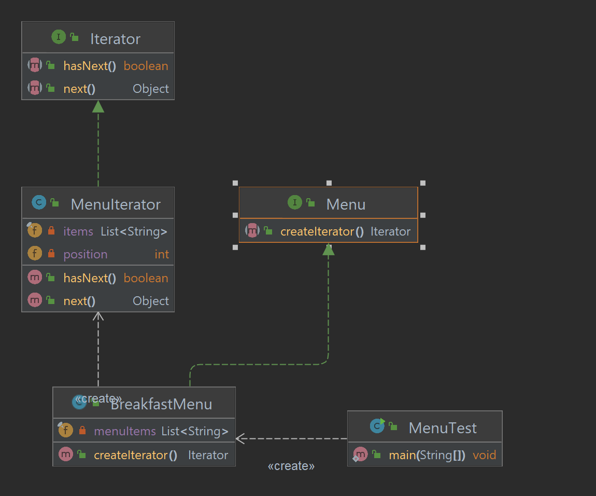

# Chapter 9: Iterator Pattern - Simplifying Traversal

## What is the Iterator Pattern?
The **Iterator Pattern** is a behavioral design pattern that provides a way to sequentially access elements of a collection without exposing its underlying representation. It decouples the client from the collection's structure, making it easier to iterate over elements in a consistent way.

---

## Key Components of the Iterator Pattern
1. **Iterator Interface**:
    - Defines methods like `hasNext()` and `next()` to traverse the collection.
2. **Concrete Iterator**:
    - Implements the Iterator interface and tracks the current position.
3. **Aggregate (Collection) Interface**:
    - Defines a method to create an iterator (e.g., `createIterator()`).
4. **Concrete Aggregate (Collection)**:
    - Implements the Aggregate interface and provides an iterator for its elements.
5. **Client**:
    - Uses the iterator to traverse the collection without knowing its internal details.

---

## Why Use the Iterator Pattern?
- **Encapsulation**: Hides the internal structure of collections.
- **Consistency**: Provides a uniform way to traverse different types of collections.
- **Flexibility**: Allows multiple iterators to operate on the same collection independently.

---

## How It Works
1. Create an **Iterator Interface** with traversal methods.
2. Implement a **Concrete Iterator** for the collection.
3. Define an **Aggregate Interface** with a method to return an iterator.
4. Implement the **Concrete Aggregate** that creates and returns its iterator.
5. The **Client** uses the iterator to access elements.

---
### Project Structure
```
src/main/java/com/headfirst/chapter9/iterator_compositePattern/iterator
├── menu/
│   ├── Iterator.java              # Iterator Interface
│   ├── Menu.java                  # Aggregate Interface
│   ├── MenuIterator.java          # Concrete Iterator
│   ├── BreakfastMenu.java         # Concrete Aggregate
│   └── MenuTest.java              # Client
└── filesystem/
├── FileSystemIterator.java    # Real-world Iterator
├── FileSystemTest.java        # Real-world Client
```

## Example: Menu Iterator
Consider a restaurant menu system where we need to traverse multiple menu collections (e.g., Breakfast Menu, Lunch Menu) without exposing their internal implementations.

### Class Diagram


### Example Code

#### **Iterator Interface**
```java
public interface Iterator {
    boolean hasNext();
    Object next();
}
```

#### **Concrete Iterator**
```java
import java.util.List;

public class MenuIterator implements Iterator {
    private final List<String> items;
    private int position = 0;

    public MenuIterator(List<String> items) {
        this.items = items;
    }

    @Override
    public boolean hasNext() {
        return position < items.size();
    }

    @Override
    public Object next() {
        if (!hasNext()) {
            throw new IllegalStateException("No more items");
        }
        return items.get(position++);
    }
}
```

#### **Aggregate Interface**
```java
public interface Menu {
    Iterator createIterator();
}
```

#### **Concrete Aggregate**
```java
import java.util.List;

public class BreakfastMenu implements Menu {
    private final List<String> menuItems;

    public BreakfastMenu(List<String> menuItems) {
        this.menuItems = menuItems;
    }

    @Override
    public Iterator createIterator() {
        return new MenuIterator(menuItems);
    }
}
```

#### **Client**
```java
import java.util.Arrays;

public class MenuTest {
    public static void main(String[] args) {
        Menu breakfastMenu = new BreakfastMenu(Arrays.asList("Pancakes", "Waffles", "Omelette"));
        Iterator iterator = breakfastMenu.createIterator();

        System.out.println("Breakfast Menu:");
        while (iterator.hasNext()) {
            System.out.println("- " + iterator.next());
        }
    }
}
```

---

## Real-World Applications 🌍
### Example : File System Traversal
In a file system, an iterator can be used to traverse files and directories without exposing the underlying structure.

### Example Code
### **FileSystemGenerator**
```java
package com.headfirst.chapter9.iterator_compositePattern.iterator.filesystem;

import java.io.File;

/**
 * Iterator for traversing files and directories in a file system.
 */
public class FileSystemIterator {
    private final File[] files;
    private int position = 0;

    public FileSystemIterator(File directory) {
        if (!directory.isDirectory()) {
            throw new IllegalArgumentException("Provided file is not a directory.");
        }
        this.files = directory.listFiles();
    }

    public boolean hasNext() {
        return position < files.length;
    }

    public File next() {
        if (!hasNext()) {
            throw new IllegalStateException("No more files.");
        }
        return files[position++];
    }
}

```

### **FileSystemTest**
```java
package com.headfirst.chapter9.iterator_compositePattern.iterator.filesystem;

import java.io.File;

/**
 * Client to test FileSystemIterator.
 */
public class FileSystemTest {
    public static void main(String[] args) {

        File directory = new File("src/main/java/com/headfirst/chapter9/iterator_compositePattern/iterator/filesystem");

        if (!directory.exists() || !directory.isDirectory()) {
            System.out.println("Invalid directory path.");
            return;
        }

        FileSystemIterator iterator = new FileSystemIterator(directory);

        System.out.println("Files in the directory:");
        while (iterator.hasNext()) {
            File file = iterator.next();
            System.out.println("- " + file.getName());
        }
    }
}

```

---
## More Examples
### Example 1: Database Result Sets
Database APIs often use iterators to traverse query results, enabling uniform access to rows.

### Example 2: UI Components
UI frameworks use iterators to traverse and manage collections of components like buttons and text fields.

---

## Summary Table
| **Component**      | **Responsibility**                                   |
|--------------------|------------------------------------------------------|
| Iterator           | Provides traversal methods (`hasNext()`, `next()`)   |
| Concrete Iterator  | Implements traversal logic for a specific collection |
| Aggregate          | Defines a method to create an iterator               |
| Concrete Aggregate | Implements the Aggregate and provides an iterator    |

---

The **Iterator Pattern** simplifies traversal while encapsulating collection structures, making it an essential tool for flexible and maintainable code. 🚀

